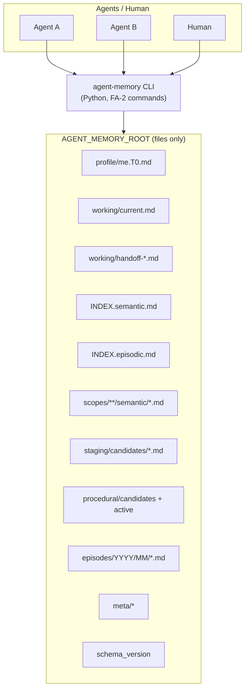
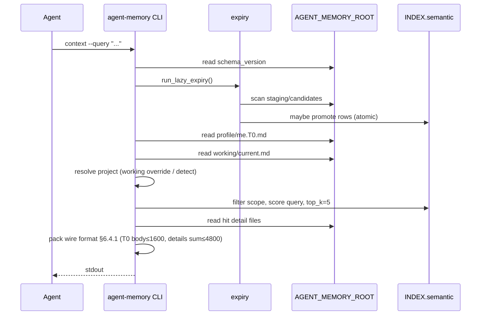
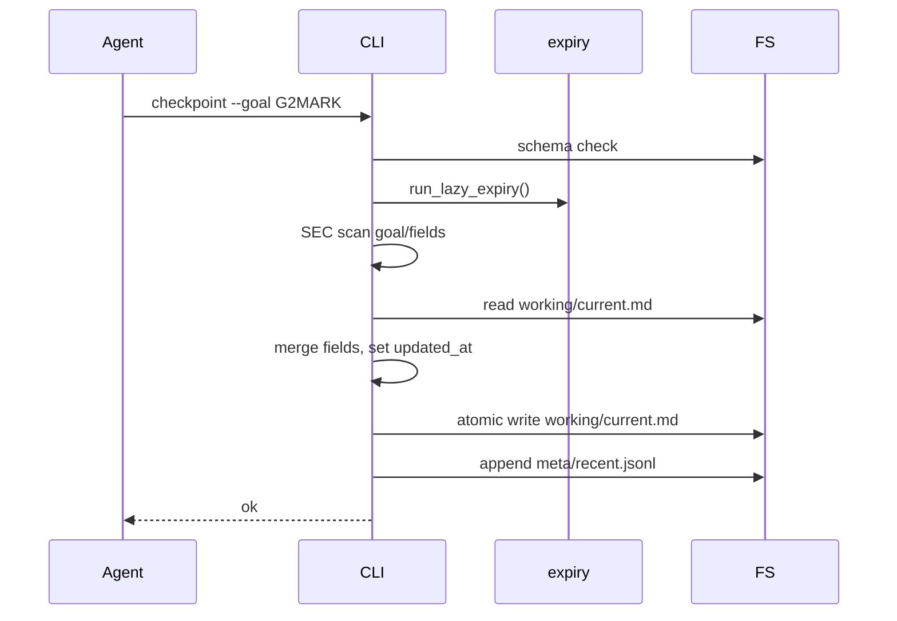

# Personal Agent Memory System (v1) — Design Document

| Item | Value |
|------|-------|
| Document ID | DESIGN-AGENT-MEMORY |
| Version | **0.3** |
| Status | **Frozen** (adversarial rounds complete; 0 open P0/P1) |
| Date | 2026-07-17 |
| Author | TBD |
| Requirements | REQ-AGENT-MEMORY **v1.2 Frozen** |
| Implementation language | Python 3.10+ (stdlib-first + **PyYAML**) |

---

## Overview

This design specifies a **pure-file personal agent memory system**: a single directory root (`AGENT_MEMORY_ROOT`) stores working state, handoffs, episodic summaries, semantic memories (active + staging), and split L0 indexes. A minimal CLI implements the **exhaustive** FA-2 command set so that any agent (or human) can read and write the same tree without a database, vector store, MCP, or git productization.

The system separates **L-Core** (deterministic CLI + file rules, no LLM required for acceptance), **L-Protocol** (when agents should call commands — documented in PROTOCOL.md), and **L-Ref** (one reference integration + demo script). Hierarchical retrieval (INDEX → detail files), project scope isolation, staging candidates with lazy expiry, security gates on all write paths, and atomic INDEX updates are first-class.

---

## Background & Motivation

### Current pain

| Pain | Effect |
|------|--------|
| Agent amnesia across windows/tools | Task state lost; user re-explains |
| Preferences re-taught every session | Waste of tokens and patience |
| Project conventions leak across repos | Wrong defaults applied |
| Unbounded “memory dumps” | Noise drowns signal; security risk |
| Vendor-locked memory APIs | Cannot share one store across tools |

### Requirements baseline (locked)

REQ v1.2 Frozen: B1–B14. Non-goals include git sync productization, DB/vector SoT, MCP, multi-tenant ACL, multi-active working, daemons/cron, full-chat archives, and auto-promotion of procedural memory.

### Historical draft

`agent-memory/` under the workspace is **historical only** (PROTOCOL v2 sketch). This design may specify a clean scaffold; layouts may align where useful but are not bound to draft filenames or schema `2.0.0`.

---

## Goals & Non-Goals

### Goals

1. Single portable memory root; set `AGENT_MEMORY_ROOT` and run CLI.
2. Vendor-neutral PROTOCOL for multi-agent shared use.
3. Hierarchical retrieval: scan INDEX, then load detail files within budgets.
4. Staging → active via importance + observation window; `remember` immediate active.
5. Project isolation with `project-detect` and low-confidence write blocks.
6. Exhaustive FA-2 CLI; L-Core testable without LLM.
7. Security gates on every CLI write path (secrets, tool/web source bans, size limits).

### Non-Goals (v1)

- Git remote/push/pull as product feature
- Cross-machine automatic sync
- DB or vector DB as source of truth
- MCP server
- Time-range rollback (have forget/reject/recent)
- Multi-tenant / ACL
- Multi-active working isolation
- Daemon / cron for expiry
- Auto-promote procedural candidates
- Full-text chat archival as searchable semantic memory
- Forcing arbitrary agents to obey protocol (L-Protocol / L-Ref only)

---

## Proposed Design

### 1. High-level architecture



**Source of truth**: files under the root. Indexes are rebuildable projections (`reindex`) but are **hot path** for search; writes keep them consistent via atomic rename.

### 2. Package layout (implementation)

```text
agent_memory/                    # Python package (installable)
  __init__.py
  __main__.py                    # python -m agent_memory
  cli.py                         # argparse entry, FA-2 commands
  config.py                      # root resolution, schema, defaults
  models.py                      # dataclasses for front matter
  io_atomic.py                   # write_text_atomic, index lock helpers
  frontmatter.py                 # YAML front matter via PyYAML
  index.py                       # INDEX parse, query, rebuild, atomic write
  resolve.py                     # id → path resolution order (§6.6)
  security.py                    # SEC gates + fixture patterns
  project_detect.py              # FJ-* heuristics + --force-confidence
  write_gate.py                  # project semantic match-target gate (KD-22)
  expiry.py                      # lazy expiry (FM-3/FM-4)
  commands/
    init.py
    doctor.py
    reindex.py
    context.py
    search.py
    get.py
    checkpoint.py
    handoff.py
    session_end.py
    extract.py
    remember.py
    forget.py
    reject.py
    promote.py
    recent.py
    gc.py
    project_detect_cmd.py
  extract_rules.py               # deterministic extract (fixture mode)
PROTOCOL.md                      # L-Protocol obligations (shipped with package + written on init)
tests/
  fixtures/
    secrets/
    episodes/
  test_ac_*.py                   # map 1:1 to AC-* where practical
pyproject.toml
README.md
```

**CLI entrypoints** (any one is enough for v1):

- `python -m agent_memory <cmd> ...`
- console script: `agent-memory <cmd> ...` (preferred after install)

**Default root** (when `AGENT_MEMORY_ROOT` unset): `~/.agent-memory`  
Documented in `--help`, README, and PROTOCOL.

**schema_version file content**: `1.0.0` (single line, strip whitespace).  
Compatible versions for this CLI: exact match `1.0.0` for writes. Reads of unknown version: warn on read-only commands if desired; **writes always fail** with non-zero exit and message (FC0-2).

### 3. Directory tree (memory root)

```text
$AGENT_MEMORY_ROOT/
  schema_version                 # "1.0.0"
  PROTOCOL.md                    # copy of protocol (init)
  README.md                      # human install notes (init)

  profile/
    me.T0.md                     # T0 hard constraints / style (user-edited)

  working/
    current.md                   # single active working (FW-W)
    handoff-YYYYMMDD-HHMMSS.md   # handoff snapshots

  scopes/
    global/
      semantic/                  # active semantic files, scope=global
    projects/
      <project_id>/
        PROJECT.md               # optional one-pager (init template)
        semantic/                # active semantic, scope=project:<id>

  staging/
    candidates/                  # semantic candidates (default not searchable)

  history/
    semantic/                    # superseded / soft-deleted bodies (optional move)

  episodes/
    YYYY/
      MM/
        <episode_id>.md

  procedural/
    candidates/                  # procedural candidates only via extract/manual
    active/                      # only after promote with gates

  archive/
    episodes/                    # GC-archived episodes (FG-2)

  INDEX.semantic.md              # L0 active semantic (+ procedural active headers)
  INDEX.episodic.md              # L0 episodes

  meta/
    recent.jsonl                 # recent write log (FF-3/FF-4)
    quotas.md                    # documented quotas (informational + doctor)
    audit.jsonl                  # optional append-only audit (best-effort)
    rejected.jsonl               # reject registry (id → never auto-promote)
```

**Design notes:**

| Concern | Choice |
|---------|--------|
| One memory one file | FC-1: each semantic/episode/procedural id → one path |
| Single working | Only `working/current.md` is active; handoffs are snapshots |
| Staging not in INDEX | Candidates live only under `staging/candidates/`; not rows in INDEX.semantic |
| Superseded | Old active: `status: superseded`, removed from INDEX; file **always moved** to `history/semantic/` (or `history/procedural/`) — never “kept in place” as active path (KD-20) |
| Procedural auto-active | **Forbidden** on extract path |

### 4. File formats

#### 4.1 Character definition (REQ §9.1)

- **Character** = Unicode code point count = Python 3 `len(str)`.
- All budgets (T0, context details, episode body, one_liner) use this definition only.

#### 4.2 Timestamps

- ISO-8601 with offset preferred, e.g. `2026-07-17T14:00:00+08:00`.
- **Natural-day** arithmetic (REQ §9.2): convert to root timezone (default: local), take calendar date, difference in days ≥ D.
- Tests may mutate `created_at` in front matter (AC-9).

#### 4.3 Semantic memory (active or candidate)

Path examples:

- Active global: `scopes/global/semantic/sem_<slug>.md`
- Active project: `scopes/projects/<project_id>/semantic/sem_<slug>.md`
- Candidate: `staging/candidates/sem_<slug>.md`

```markdown
---
id: sem_fruit_pref
type: semantic
content_kind: preference   # constraint|preference|fact|decision|anti_pattern|open_question|other
status: active             # candidate|active|superseded|discarded|deleted|rejected
scope: global              # global | project:<project_id>
title: Preferred fruit
one_liner: Current preference is oranges
tags: [preference, food]
slot: fruit                # optional; unique active per slot within scope
importance: 10             # 1-10
source:
  kind: user_explicit      # user_explicit|extracted|handoff|tool_output|web
  agent: null              # optional string
  episode_id: null         # optional
created_at: 2026-07-17T14:00:00+08:00
updated_at: 2026-07-17T14:00:00+08:00
supersedes: null           # previous id if any
schema_version: "1.0.0"
---

喜欢橘子。
```

**Required fields for write acceptance:** `id`, `type`, `status`, `scope`, `content_kind` (semantic), `one_liner` (≤80 chars), `importance`, `source.kind`, `created_at`, `updated_at`.

**`one_liner` derivation (locked — all semantic/procedural writers):**

```text
function derive_one_liner(content: str, explicit: str | None, title: str | None) -> str:
  if explicit is not None:   # --one-liner flag
    raw = explicit
  else:
    # first non-empty line of body content; if empty, fall back to title; else ""
    raw = first_nonempty_line(content) or (title or "")
  raw = raw.strip().replace("\n", " ")
  if len(raw) <= 80:         # Unicode code points = len(str)
    return raw
  # truncation marker counts toward the 80 budget
  marker = "…[truncated]"
  keep = 80 - len(marker)
  return raw[:keep] + marker
```

- Body markdown = full `--content` (or extract text); **not** truncated to 80.
- INDEX always stores the derived `one_liner` (≤80).

**Slot rule (FM-7 / FP-1):** Within the same `scope`, at most one semantic with `status: active` and a given non-null `slot`. New write **always creates a new id**, sets old `status→superseded`, removes old from INDEX, and **moves** the old file to `history/semantic/<id>.md` (KD-19, KD-20).

#### 4.4 Episode

Path: `episodes/YYYY/MM/<id>.md`

```markdown
---
id: ep_20260717_140000_handoff_work
type: episodic
status: active
scope: project:my-app      # or global
project_id: my-app         # optional mirror
title: Session summary
one_liner: Finished API auth design
session_id: null
importance: 5
source:
  kind: handoff
created_at: 2026-07-17T14:00:00+08:00
updated_at: 2026-07-17T14:00:00+08:00
schema_version: "1.0.0"
---

Markdown body. Character count of body (after front matter) MUST be ≤ 8000.
If longer, session-end FAILS (no truncate).
```

#### 4.5 Working (`working/current.md`)

```markdown
---
id: working_current
type: working
status: active
project_id: null           # if set, overrides project-detect (FJ-3)
session_id: null
goal: ""
updated_at: 2026-07-17T14:00:00+08:00
schema_version: "1.0.0"
---

# Working · CURRENT

## Goal
...

## Decisions
...

## Next steps
...

## Related memory ids
...

## Open questions
...
```

`checkpoint` updates: at minimum `goal` / structured sections as provided by flags, and always `updated_at`.

#### 4.6 Handoff (`working/handoff-YYYYMMDD-HHMMSS.md`)

Front matter **must** include (FW-4):

| Field | Type |
|-------|------|
| `id` | string |
| `type` | `handoff` |
| `goal` | string |
| `decisions` | list or markdown section (both OK; structured preferred in YAML) |
| `next_steps` | list |
| `related_ids` | list of memory ids |
| `project_id` | string or null |
| `session_id` | string or null |
| `updated_at` / `created_at` | ISO-8601 |
| `source.kind` | `handoff` |

#### 4.7 T0 (`profile/me.T0.md`)

- Free-form markdown with optional front matter.
- Injected by `context` under hard budget **≤ 1600 characters** (truncated with explicit marker if longer).
- Does **not** consume semantic `top_k` slots (FR-1).

#### 4.8 Procedural (Model A — locked)

Same envelope as semantic with `type: procedural`. **Paths are type-segregated (not mixed into staging):**

| State | Path |
|-------|------|
| Candidate | `procedural/candidates/<id>.md` |
| Active | `procedural/active/<id>.md` |
| Superseded / soft-deleted | `history/procedural/<id>.md` (or status on file + out of INDEX) |

- **`extract`** may write `type: procedural` → **only** `procedural/candidates/` (never active).
- **`extract`** may write `type: semantic` → **only** `staging/candidates/`.
- Default `search`/`context` ignore both candidate dirs; active procedural rows may appear in INDEX.semantic but **default search filters `type=semantic` only**.
- Promote rules (FPr-2): require `--user-confirmed` **or** ≥2 related episode ids.

---

### 5. INDEX format

#### 5.1 INDEX.semantic.md

Markdown table, one data row per active semantic or active procedural. Header fixed for machine parse.

```markdown
# INDEX.semantic

| id | type | content_kind | scope | slot | one_liner | path | updated_at |
|----|------|--------------|-------|------|-----------|------|------------|
| sem_fruit_pref | semantic | preference | global | fruit | Current preference is oranges | scopes/global/semantic/sem_fruit_pref.md | 2026-07-17T14:00:00+08:00 |
```

**Rules:**

- Only `status: active` rows.
- Staging / rejected / deleted / discarded / superseded: **absent**.
- Parse: skip non-table lines; require `|` rows; ignore separator row (`|---|`).
- `one_liner` cell: escape `|` as `\|` if needed; keep ≤80 chars at write time.
- Active row count ≥ 300 → **block new active** inserts (FR-8 / FG-3) until `gc` / forget reduces count.
- **Quota counts every active row in INDEX.semantic**, including `type=procedural` (shared L0 table). New `remember` / semantic promote / procedural promote all subject to the same 300 cap.
- Semantic and procedural share this index for L0 listing; **search default mode is semantic** and filters `type=semantic` only (procedural never mixed into semantic top_k).

**v1 search mode (locked):**

- `search` default: semantic active only from INDEX.semantic where `type=semantic`.
- `search --mode episodic`: INDEX.episodic only.
- `search --mode procedural` (optional convenience): INDEX.semantic where `type=procedural` only; still not mixed with semantic.
- No mixed top_k across modes (FR-4).

#### 5.2 INDEX.episodic.md

```markdown
# INDEX.episodic

| id | project_id | one_liner | path | created_at |
|----|------------|-----------|------|------------|
| ep_20260717_140000_x | my-app | Finished API auth design | episodes/2026/07/ep_....md | 2026-07-17T14:00:00+08:00 |
```

#### 5.3 Atomic write algorithm (FC-2 / AC-11)

```text
function atomic_write_index(path, full_text):
  dir = dirname(path)
  ensure_dir(dir)
  fd, tmp = mkstemp(prefix=".index-", suffix=".tmp", dir=dir)
  try:
    write(fd, full_text)           # full replacement content
    fsync(fd)
    close(fd)
    os.replace(tmp, path)          # atomic on same filesystem (POSIX rename)
  except:
    close_if_open(fd)
    unlink(tmp) if exists
    raise
```

**Concurrency notes:**

- Two processes rewriting INDEX: last `os.replace` wins; each file is complete (no half-line truncate) — satisfies AC-11 “可完整解析”.
- Optional P1: `meta/.lock` with `fcntl.flock` around read-modify-write of INDEX (FC-3).
- **Working overwrite risk (FC-4 / B14):** document that two agents updating `working/current.md` may lose updates; v1 single active working is intentional.

**INDEX update pattern (all writers):**

1. Load INDEX into memory (or rebuild row set).
2. Apply mutation (add/remove/update row).
3. Serialize full table text.
4. `atomic_write_index`.

Never append a single line without rewrite of the whole file (avoids partial lines under crash mid-append).

#### 5.3.1 Multi-file write order & crash recovery (locked)

Logical ops touch body + INDEX + recent. **Order for every multi-file mutator** (`remember`, `promote`, expiry promote, `forget` soft, `session-end`, supersede):

```text
1. Write/move body files first (new active file; move superseded → history/; staging delete after copy)
2. Atomic INDEX rewrite (full table via os.replace) — source of truth for default search
3. Append/replace recent log last (best-effort; failure → stderr warning, exit still 0 if 1–2 ok)
```

| Crash window | Symptom | Healing |
|--------------|---------|---------|
| After body, before INDEX | Orphan active file not in INDEX | `reindex` adds row; `doctor` reports orphan |
| After INDEX, before body complete | INDEX path missing | `doctor` error-level; `reindex` drops dead rows or operator fixes |
| recent only | Stale recent | Non-fatal; next ops append |

**session-end specific:** validate body length + SEC **before any write**; then write episode body → atomic INDEX.episodic → touch working `updated_at` → recent. If episode write fails, leave working/INDEX unchanged.

**remember supersede:** write new active body → move old to `history/semantic/` with `status: superseded` → atomic INDEX (remove old id, add new) → recent.

#### 5.4 reindex (FC0-4)

1. Scan `scopes/**/semantic/*.md`, `procedural/active/*.md` for `status: active` → rebuild INDEX.semantic.
2. Scan `episodes/**/*.md` (not under `archive/`) for non-deleted → rebuild INDEX.episodic.
3. Atomic write both indexes.
4. Ignore `staging/`, `procedural/candidates/`, `history/`, `archive/` for default indexes.

---

### 6. Exact CLI interface (FA-2 exhaustive)

Global options (all commands):

| Flag | Description |
|------|-------------|
| `--root PATH` | Override root (else `AGENT_MEMORY_ROOT`, else `~/.agent-memory`) |
| `--help` | Help; documents default root |
| `-q` / `--quiet` | Less stderr |
| `--json` | Machine-readable stdout where defined in §6.0.1 |

Exit codes: `0` success; `2` usage error; `3` schema incompatible; `4` security reject; `5` quota/id conflict; `6` not found / invalid state; `1` other failure.

#### 6.0.1 Minimal `--json` schemas (locked)

| Command | Success stdout JSON |
|---------|---------------------|
| `search` | `{"hits":[{"id":str,"score":number,"one_liner":str,"path":str,"scope":str}],"mode":"semantic\|episodic"}` |
| `project-detect` | `{"project_id":str,"confidence":"high\|low"}` |
| `remember` | `{"id":str,"path":str,"superseded":[str]}` |
| `session-end` | `{"episode_id":str,"path":str}` |
| `extract` | `{"candidates":[{"id":str,"type":str,"path":str}]}` |
| `get` | `{"id":str,"path":str,"meta":object,"body":str}` |
| `handoff` | `{"id":str,"path":str}` |
| others | Optional; text stdout remains default. Defer richer schemas. |

Without `--json`, human text formats apply (context wire format is always text per §6.4; `--json` on context is **not** required in v1).

#### 6.1 `init`

```text
agent-memory init [--force]
```

Creates empty legal store: `schema_version`, T0 template, empty INDEX tables, working skeleton, `meta/` files, PROTOCOL.md copy, directory tree.

**Init safety policy (locked):**

| Condition | Behavior |
|-----------|----------|
| No `schema_version` and root empty / missing | Create full tree; exit 0 |
| `schema_version` exists, **without** `--force` | Refuse; non-zero exit; message “already initialized” |
| `schema_version` exists **or** any of `scopes/**/semantic`, `episodes/**`, `staging/candidates`, `procedural/**` has `.md` files, **with** `--force` | **Still refuse** non-zero — do not wipe user data |
| Root has only empty dirs / no memory bodies, `--force` | Allowed to rewrite templates + empty INDEXes + schema_version |

v1 does **not** provide a destructive wipe flag (out of scope).

#### 6.2 `doctor`

```text
agent-memory doctor
```

Reports (non-zero if any error-level finding):

- INDEX vs files: missing path, orphan active file not in INDEX, id mismatch
- Unparseable front matter / bad files
- Active semantic count vs quota 300
- High-risk secret patterns in scanned files (SEC-7 best-effort)
- schema_version presence

#### 6.3 `reindex`

```text
agent-memory reindex
```

Rebuild indexes from bodies; atomic write.

#### 6.4 `context`

```text
agent-memory context [--query TEXT] [--project ID] [--top-k N] [--include-staging]
```

**Must** (FR-1):

1. Run lazy expiry (FM-4).
2. Emit T0 section (body ≤1600 chars; truncate + `…[truncated]` marker).
3. Emit working section if working file exists and is non-empty of useful fields; **omit entire `## Working` section** if no working file.
4. Run one semantic search (default scope global ∪ project:current; query default empty → rank by `updated_at` desc among in-scope, still top_k).
5. Load detail **bodies** for hits; sum of detail bodies ≤ 4800 with truncation markers.
6. T0 does not count toward top_k.
7. **`--include-staging` on context (locked):** if set, may append a fourth section `## Staging (candidates)` after Semantic, using the same staging scan rules as `search --include-staging`. Staging body text **counts toward the same 4800 budget pool as Semantic bodies** (fill Semantic first, then Staging until budget exhausted). Default context (**no** flag) emits **no** Staging section.

Default `--top-k` = 5.

##### 6.4.1 Context stdout wire format (locked)

Stable layout for AC-T0 / AC-1 / L-Ref parsers:

```text
## T0
<body of profile/me.T0.md after stripping YAML front matter if any;
     if len(body) > 1600: body = body[:1600 - len("…[truncated]")] + "…[truncated]">

## Working
<working markdown body after front matter; no hard char budget in REQ;
 if working file missing: omit this entire section including header>

## Semantic (top_k=<N>)
### <id> — <one_liner>
<body of hit 1 detail after front matter>
### <id> — <one_liner>
<body of hit 2>
...
```

**Budget measurement (locked):**

| Budget | What is measured | Headers count? |
|--------|------------------|----------------|
| T0 ≤1600 | Text **between** the line after `## T0` and the next `## ` heading (exclusive). | **No** — `## T0` line excluded |
| Semantic details ≤4800 | Concatenation of all hit **bodies** only (text under each `### id — …` line, not including the `###` header lines). | **No** |
| Working | No hard limit in v1 | N/A |

- Truncation marker `…[truncated]` is **included** in the measured body length.
- If no semantic hits: still emit `## Semantic (top_k=<N>)` followed by zero `###` blocks (empty section).
- AC-T0: assert `T0MARK` appears inside the T0 body region; `len(t0_body) ≤ 1600`.

#### 6.5 `search`

```text
agent-memory search [QUERY]
  [--mode semantic|episodic]   # default semantic
  [--project ID]
  [--top-k N]                  # default 5
  [--include-staging]
  [--history]                  # include superseded (P1 FR-10)
  [--json]
```

- Default excludes staging (FR-9).
- No hits → empty list, exit 0 (FR-6).
- After lazy expiry (FM-4) — **always** (even if staging empty).
- Match algorithm (v1 L-Core, deterministic):
  1. Filter INDEX rows by scope and mode (`type=semantic` for default mode).
  2. **L0 score only** against INDEX columns: `id`, `slot`, `one_liner`, `content_kind` (and for episodic: `id`, `one_liner`, `project_id`). Case-fold; token/substring overlap; substring boost.
  3. **Do not** load full bodies for ranking; **do not** use `tags` for L0 ranking (tags may appear in detail display after top_k only).
  4. Empty query: order by `updated_at`/`created_at` desc.
  5. Take top_k; load detail files **only for hits**.
  6. Text output: one hit per block `id`, score, one_liner, path; optional body snippet. With `--json`: §6.0.1.

**`--include-staging` (locked):** after INDEX hits (or instead if only staging requested with empty INDEX path), scan `staging/candidates/*.md` (+ `procedural/candidates/` when mode allows procedural), filter by scope, score `id|slot|one_liner|title|first line of body` with same token rules, return up to top_k. Staging hits **must** be labeled `status=candidate` in text/JSON so callers never treat them as active truth. Default search without flag: **zero** staging rows.

**`--history` (locked, P1 FR-10):** additionally scan `history/semantic/*.md` (and `history/procedural/` for procedural mode) with `status: superseded` (and optionally `deleted` if still on disk). Score same L0 fields from front matter. Default search **excludes** history. Superseded rows are **not** in INDEX — history is scan-based only.

**Not** a vector DB; quality is “good enough hierarchical keyword,” correct isolation and budgets are acceptance-critical.

#### 6.6 `get`

```text
agent-memory get <id> [--json]
```

Print metadata + body for one id. Exit **6** if missing.

##### Id resolution order (locked)

Used by `get`, `forget`, `reject`, `promote`, and internal writers:

```text
1. INDEX.semantic rows: match id → open path (active semantic / procedural active)
2. INDEX.episodic rows: match id → open path
3. Scan staging/candidates/*.md by front-matter id
4. Scan procedural/candidates/*.md by front-matter id
5. Scan history/semantic/*.md and history/procedural/*.md by front-matter id
6. Scan scopes/**/semantic/*.md and procedural/active/*.md (orphan active not in INDEX)
7. Scan episodes/**/*.md (excluding archive/ first; then archive/episodes/** if still missing)
8. Scan working/handoff-*.md by front-matter id
9. Special: id working_current → working/current.md
```

- First match wins; stop scan early when found.
- **Soft-deleted** (`status: deleted`) remains gettable if file exists (operability / recent follow-up).
- Hard-forgotten files: not found → exit 6.
- Promote/reject expect candidates typically at steps 3–4; promote of already-active → exit 6 invalid state.

#### 6.7 `checkpoint`

```text
agent-memory checkpoint
  [--goal TEXT]
  [--decisions TEXT | --decisions-file PATH]
  [--next-steps TEXT]
  [--project-id ID]
  [--session-id ID]
  [--related-id ID ...]
```

- Updates `working/current.md` fields + `updated_at`.
- Triggers lazy expiry (FM-4 / FW-3).
- SEC on write content.

#### 6.8 `handoff`

```text
agent-memory handoff
  --goal TEXT
  [--decisions TEXT]
  [--next-steps TEXT]          # allow multi-line; AC-1 uses STEP1MARK here
  [--related-id ID ...]
  [--project-id ID]
  [--session-id ID]
```

- **Always** writes `working/handoff-<timestamp>.md` with required FW-4 fields.
- **Always** overwrites `working/current.md` fields from the **same payload**:
  - `goal`, `decisions`, `next_steps`, `related_ids`, `project_id`, `session_id`, `updated_at`
  - Sections not provided by flags are set to empty / cleared when flag omitted? **Locked:** only fields present on CLI are overwritten; omitted optional flags leave existing working values for those fields; `--goal` is required so goal always overwrites.
  - `updated_at` always set now.
- SEC gates on handoff + working content.
- Lazy expiry: **not** on FM-4 list; do not call. (Do not expand FM-4.)

#### 6.9 `session-end`

```text
agent-memory session-end
  --title TEXT
  --body TEXT | --body-file PATH
  [--one-liner TEXT]
  [--project-id ID]
  [--session-id ID]
```

Implements FW-5 as:

1. Run lazy expiry (FM-4).
2. SEC + length check on episode body: `len(body) > 8000` → **fail before any write** (no truncate).
3. Write **exactly one** new episode (derive `one_liner` via §4.3 rule from `--one-liner` or body).
4. Atomic INDEX.episodic add.
5. **Working flush (not full checkpoint flags):** set `working/current.md` `updated_at` only; **preserve** existing goal/decisions/next_steps/related_ids/project_id unless `--project-id` / `--session-id` provided (those two may update). No `--goal` / `--decisions` flags on session-end.
6. recent log.

Does **not** require goal flags. Sequence diagram uses “touch working updated_at”, not “checkpoint flags”.

#### 6.10 `extract`

```text
agent-memory extract --from <episode_id> [--mode rules|fixture]
```

- **CLI default `--mode`:** `rules`.
- **Tests / AC-X / AC-9 / AC-P:** always pass `--mode fixture`.
- **Never** writes semantic active or procedural active.

**`--mode rules` behavior (locked, L-Core, no LLM):**

1. If episode body contains fixture grammar (`CANDIDATE:` lines or `## Extract fixtures` YAML), parse it **exactly as fixture mode** (same grammar).
2. Else apply **deterministic heuristics only**:
   - Lines matching `^(记住|remember|prefers?|preference)[:：\s].+` (case-fold) → one semantic candidate, `content_kind=preference`, importance=7, slot=`_` unless `slot=` present.
   - Lines matching `^(决定|decision|decided)[:：\s].+` → `content_kind=decision`, importance=7.
   - Lines matching `^(约束|constraint|must not|禁止)[:：\s].+` → `content_kind=constraint`, importance=7.
3. If still zero candidates → exit 0 with empty list (not an error). No invented facts.

**`--mode fixture`:** parse **only** fixture grammar; ignore heuristic lines; if grammar present but invalid → exit 2.

**Output paths (Model A):**

| Candidate type | Directory |
|----------------|-----------|
| `type: semantic` | `staging/candidates/<id>.md` |
| `type: procedural` | `procedural/candidates/<id>.md` |

**Fixture grammar (locked):**

Line form (one candidate per line):

```text
CANDIDATE: <content_kind> | <importance> | <slot_or_-> | <text>
CANDIDATE: type=procedural | <content_kind> | <importance> | <slot_or_-> | <text>
CANDIDATE: type=semantic | scope=project:foo | preference | 8 | fruit | 喜欢苹果
```

- Default `type=semantic` if omitted.
- Optional `type=semantic|procedural` and `scope=global|project:<id>` as `key=value` tokens before kind.
- `slot_or_`: use `_` or empty for no slot.
- Alternate: YAML list under episode heading `## Extract fixtures` with keys `type`, `content_kind`, `importance`, `slot`, `scope`, `text`.

**Scope default:** `candidate.scope` = episode `scope` if present, else `project:<episode.project_id>` if project_id set, else `global`. Explicit fixture `scope=` overrides. Project-scope candidates still subject to **project semantic write gate** (§7); if gate fails, that candidate write fails (other candidates in same extract may still succeed; non-zero exit if any fail).

Each candidate: FM-1 fields + `source.kind=extracted` + `source.episode_id`. Importance: fixture value or FM-2 defaults. SEC on each.

#### 6.11 `remember`

```text
agent-memory remember
  --slot <slot>
  --content TEXT
  [--title TEXT]
  [--one-liner TEXT]              # optional override; else derive from content (§4.3)
  [--scope global|project:<id>]   # default global
  [--project ID]                  # sets scope project:<id> (same as --scope project:ID)
  [--content-kind preference|constraint|fact|decision|...]
  [--force]                       # non-secret PII false positive only (SEC-2)
```

- Immediately **active** (B6 / FW-9); importance **10**.
- Default `--content-kind` = **`preference`** when `--slot` is used (always required).
- `one_liner` = derive per §4.3; body = full `--content`.
- Supersede same slot in same scope: **new id + move old to history** (KD-19).
- Security gate; **secrets cannot --force**.
- Source: `user_explicit`.
- Lazy expiry (FM-4).
- Quota check: active count < 300.
- Project-scope writes must pass §7 write gate.

**Id generation (locked — KD-19):** always mint a **new** id:

```text
id = "sem_" + utc_yyyymmdd_hhmmss + "_" + slug(slot)[:24] + "_" + hex8(sha256(content+slot+scope+timestamp))
```

Never reuse id for a new remember. Old active with same `(scope, slot)` → superseded → `history/semantic/`.

#### 6.12 `forget`

```text
agent-memory forget <id> [--hard]
```

- Resolve id via §6.6 order.
- Soft (default): set `status=deleted`; remove from INDEX if present; keep file (gettable). Not in default search (FF-1/FF-2).
- `--hard`: unlink file after INDEX removal; for secret fixtures, file must not exist (SEC-8).
- Write order: update/remove body status or unlink → atomic INDEX → recent.

#### 6.13 `reject`

```text
agent-memory reject <id>
```

- Resolve candidate (staging or procedural/candidates).
- Set `status=rejected` on file **and** append `meta/rejected.jsonl` `{"id","ts"}`.
- Never auto-promote on expiry (FM-5).

#### 6.14 `promote`

```text
agent-memory promote <id>
  [--user-confirmed]             # required for procedural without 2 episodes
  [--related-episode ID ...]
```

- Resolve id; expect `status: candidate` under `staging/candidates/` or `procedural/candidates/`.
- Semantic: move to `scopes/.../semantic/`, status active, INDEX add.
- Procedural: move to `procedural/active/`, status active, INDEX add (`type=procedural`).
- Gates: SEC, quota, source not `tool_output`/`web` (FW-8/SEC-4), project write gate if project scope.
- Lazy expiry first (FM-4).
- Procedural: `--user-confirmed` OR ≥2 related episode ids (FPr-2).

#### 6.15 `recent`

```text
agent-memory recent [--n 20]
```

- Source of truth: `meta/recent.jsonl`.
- Default n=20; print newest first.
- **Normative record keys:** `ts` (ISO-8601), `id` (string), `kind` (e.g. semantic|episodic|working|handoff|candidate), `path` (relative), `op` (e.g. remember|forget|session-end|promote|extract|checkpoint|handoff|reject|gc).
- **Write strategy:** best-effort **append** one JSON line + newline under optional `fcntl.flock` on `meta/.recent.lock` when available; document residual interleave risk under crash mid-line (doctor may skip bad lines). Full rewrite not required for every op.
- **Prune (write):** on `gc` only, drop entries whose `ts` calendar age **> 30** natural days. Never prune entries ≤30 days. After prune, remaining history still covers ≥30 days of retention window (FF-4).
- **`recent` is read-only:** list + filter expired in memory; do **not** rewrite `meta/recent.jsonl` (sandbox agents need audit without write access).

#### 6.16 `gc`

```text
agent-memory gc [--dry-run]
```

1. Lazy expiry (all due candidates).
2. Quota report / enforce guidance.
3. Episode TTL 90 days: **archive** (move to `archive/episodes/...`, remove or mark INDEX.episodic row) — **chosen strategy: archive, not hard-delete** (FG-2 measurable).
4. Optional near-duplicate merge (P1 FG-4): skip in MVP PR; leave TODO.

#### 6.17 `project-detect`

```text
agent-memory project-detect [PATH]
  [--force-confidence low|high]  # test/debug only (FJ-4)
  [--json]
```

Stdout: `project_id` + `confidence` ∈ {`high`,`low`}.

---

### 7. project-detect algorithm (FJ-*, D-2)

**Input:** path (default `cwd`), optional `--force-confidence`.

**If `--force-confidence` set:** run heuristics for `project_id` still, but **override** confidence to the forced value (for AC-10).

**Heuristic order (FJ-5):**

```text
1. Marker file walk upward from PATH (max 40 levels or until FS root):
   - Prefer first found among:
     a) .agent-memory-project  (content: project_id string, or YAML id:)
     b) AGENT_PROJECT  (same)
   If found → project_id = normalized id, confidence = high

2. Git root:
   - Run `git rev-parse --show-toplevel` if git available
   - project_id = basename(toplevel), kebab-case normalize
   - **confidence = high** only if:
     - toplevel path is not the user home directory (`Path(toplevel).resolve() != Path.home().resolve()`), **and**
     - basename is non-empty after normalize
   - If git root **is** home (or unreadable): treat as **not found**, fall through (do not high-trust “username” as project)

3. Directory basename of PATH if it looks like a project (has package.json / pyproject.toml / go.mod / Cargo.toml / Package.swift / pom.xml):
   - project_id = basename, confidence = high

4. Else:
   - project_id = basename(cwd) or "unknown"
   - confidence = low
```

**Normalize:** lowercase, replace spaces/underscores with `-`, strip unsafe chars (keep only `[a-z0-9-]` after lowercasing).

**Effective project identity (search defaults / “current”):**

```text
function effective_current_project(cwd, working):
  if working.project_id:
    return working.project_id, "high"   # FJ-3: working overrides detect
  pid, conf = project_detect(cwd)       # includes --force-confidence if used on detect only
  return pid, conf
```

**Project semantic write gate (FJ-2 — locked, match-target):**

Allow write of semantic (staging **or** active) with `scope=project:<target>` **iff all** hold:

```text
1. Let pid, conf = effective_current_project(cwd, working)
2. conf == "high"
3. pid == target          # high for *some other* project does NOT authorize project:A
```

Otherwise → **fail** non-zero (exit 5 or 6), no file written.

| Scenario | Result |
|----------|--------|
| detect high B, write project:A | **Deny** |
| working.project_id=B, write project:A | **Deny** |
| working.project_id=A, write project:A | **Allow** (conf treated high for A) |
| detect high A, write project:A | **Allow** |
| conf low, write project:* | **Deny** |
| conf low, write episode / working / global semantic | **Allow** |

**Expiry auto-promote** uses the same gate with `target` from candidate.scope; on deny → **skip** promote, leave candidate (safe).

**How tests get high for AC-2:**

1. Preferred: `checkpoint --project-id A` or write working.project_id=A before `remember --project A`, **or**
2. Run under a directory with marker/git root id A, **or**
3. **Test-only env hook** `AGENT_MEMORY_FORCE_PROJECT=A` + `AGENT_MEMORY_FORCE_CONFIDENCE=high` (debug; documented like `--force-confidence`; not a user product feature).  
   Note: `--force-confidence` remains on `project-detect` command; writers read effective project via working override or the env test hook so AC-10/AC-2 stay deterministic without changing FA-2 command list.

**Test hooks:** `--force-confidence=low|high` on `project-detect`; env hooks above for write-path tests. Documented as test/debug.

---

### 8. Lazy expiry algorithm (FM-3 / FM-4)

**Trigger commands (mandatory, non-disableable):**  
`gc`, `checkpoint`, `session-end`, `remember`, `promote`, `search`, `context`  
(+ `dream` if implemented).

```text
function run_lazy_expiry(root):
  # Semantic candidates only auto-expire (procedural never auto-active — FPr-2)
  for each file in staging/candidates/*.md:
    meta = parse(file)
    if meta.status in (rejected, discarded, deleted): continue
    if meta.id in rejected_registry: continue
    if meta.type == procedural: continue  # should not live here; doctor may flag

    age_days = calendar_days_between(date(meta.created_at), today(root_tz))
    if age_days < D:  # D=5
      continue

    if meta.importance >= 7:
      if source.kind in (tool_output, web):
        mark discarded; do not active; continue
      if scope is project:<target> and not project_semantic_write_allowed(target):
        # same match-target gate as §7; skip, leave candidate
        continue
      if active_count >= 300:
        skip promote (leave candidate); doctor/gc reports pressure
        continue
      if slot conflict: supersede old active (new stays; old → history)
      move to scopes/.../semantic/, status=active   # write order §5.3.1
      add INDEX.semantic row
      remove staging file
      recent log
    else:
      # importance < 7 → discard
      delete or status=discarded on staging file
      not in INDEX
```

**Observation period D=5 natural days** (REQ §9.2).  
**reject** prevents auto-promote forever.  
**Procedural candidates** are never auto-promoted by expiry.

---

### 9. Importance defaults (FM-2)

| Situation | importance |
|-----------|------------|
| `remember` | **10**, immediate active |
| content_kind ∈ {constraint, preference, decision} | **at least 7** (use 7 if unspecified) |
| content_kind = fact | **5** |
| other / unknown | **4** |
| extract fixture explicit value | use fixture value |

Factory defaults are not removable by config in a way that breaks AC (D-4: config may raise but not lower factory floors for those kinds if config is added later; **v1 ships no user config for importance** — only code defaults).

---

### 10. Security (SEC-*)

#### 10.1 Gate placement

Every CLI write path (FW-10 / SEC-6): working, handoff, episode, staging, active semantic, procedural, promote, remember, checkpoint, session-end, extract.

Pipeline:

```text
1. schema_version check
2. id conflict check (if new id)
3. size limits (episode body ≤8000, one_liner ≤80, …)
4. source.kind whitelist for target state
5. secret pattern scan
6. PII-ish patterns (ID card / bank) — forceable with --force + warning
7. project confidence for project-scope semantic
8. active quota for new active
```

#### 10.2 Secret detection patterns (AC-8 fixtures)

| Pattern ID | Regex / rule (Python) | Force bypass |
|------------|----------------------|--------------|
| S-API-KEY-ASSIGN | `(?i)api[_-]?key\s*=\s*\S+` | **No** |
| S-SK-PREFIX | `(?i)(?<![A-Za-z0-9])sk-[A-Za-z0-9_\-]{8,}` | **No** |
| S-BEARER | `(?i)Bearer\s+[A-Za-z0-9\-._~+/]+=*` | **No** |
| S-PEM-KEY | `-----BEGIN[ A-Z0-9]*PRIVATE KEY-----` | **No** |
| S-AWS-KEY | `(?i)AKIA[0-9A-Z]{16}` | **No** |
| S-GENERIC-TOKEN | `(?i)(xox[baprs]-)[0-9A-Za-z-]{10,}` | **No** |

**AC-8 fixture string (must reject):** `api_key=sk-test-forbidden`  
Matches both S-API-KEY-ASSIGN and S-SK-PREFIX.

#### 10.3 Non-secret sensitive (forceable)

| Pattern ID | Rule | Force |
|------------|------|-------|
| P-CN-ID | `(?<!\d)[1-9]\d{5}(?:19|20)\d{2}(?:0[1-9]|1[0-2])(?:0[1-9]|[12]\d|3[01])\d{3}[\dXx](?!\d)` | `--force` + warning |
| P-BANK-16 | `(?<!\d)(?:\d[ -]*?){16,19}(?!\d)` with Luhn optional weak | `--force` + warning |

Secrets always **cannot** use `--force` (SEC-2).

#### 10.4 Source bans (FW-8 / SEC-4)

`tool_output` and `web` **must not** become semantic active via promote/remember.  
Mislabel → reject write.

#### 10.5 Scope of AC-8

CLI paths only. Direct file writes = protocol violation + doctor best-effort (SEC-7).

---

### 11. Retrieval & budgets

| Parameter | Value |
|-----------|-------|
| Semantic top_k | 5 |
| Context semantic details total | ≤ 4800 chars |
| T0 section total | ≤ 1600 chars |
| one_liner | ≤ 80 chars |
| Episode body | ≤ 8000 chars (fail if over) |
| Active semantic INDEX rows | max 300 |
| Observation D | 5 days |
| Promote threshold | importance ≥ 7 |
| Episode archive TTL | 90 days |
| recent default n | 20 |
| recent retention | ≥ 30 days |
| Checkpoint N (protocol) | 8 user messages |

**Default search scope:** `global` ∪ `project:<current>` (FR-5).  
`--project` overrides current for the command.

**Truncation marker (required when truncating):** literal `…[truncated]` at cut point (or end of section). Output total must still respect budget.

---

### 12. Sequence diagrams

#### 12.1 Context load



#### 12.2 Checkpoint



#### 12.3 Session-end + extract

```mermaid
sequenceDiagram
  participant Agent
  participant CLI
  participant Exp as expiry
  participant FS
  participant IdxE as INDEX.episodic

  Agent->>CLI: session-end --title T --body B
  CLI->>Exp: run_lazy_expiry()
  CLI->>CLI: len(B) > 8000 or SEC fail? abort before writes
  CLI->>FS: write episodes/YYYY/MM/ep_....md
  CLI->>IdxE: atomic add row
  CLI->>FS: touch working updated_at only (preserve goal/decisions)
  CLI->>FS: recent log
  CLI-->>Agent: episode_id

  Agent->>CLI: extract --from episode_id --mode fixture
  CLI->>FS: load episode
  CLI->>CLI: fixture grammar → candidates
  CLI->>CLI: SEC each; FM-2 importance; project write gate
  CLI->>FS: semantic → staging/candidates/
  CLI->>FS: procedural → procedural/candidates/
  Note over CLI,FS: default search misses both candidate dirs
  CLI-->>Agent: candidate ids
```

#### 12.4 Forget

```mermaid
sequenceDiagram
  participant User
  participant CLI
  participant FS
  participant Idx as INDEX.semantic

  User->>CLI: forget sem_x
  CLI->>FS: locate file by id (§6.6)
  CLI->>FS: body first — set status=deleted (soft; keep path)
  CLI->>Idx: remove row, atomic_write_index
  CLI->>FS: recent log (best-effort)
  CLI-->>User: ok

  User->>CLI: search "..."
  CLI->>Idx: active only
  Note over CLI: sem_x absent → not returned

  User->>CLI: forget sem_secret --hard
  CLI->>FS: unlink file
  CLI->>Idx: remove row
  Note over FS: file must not exist (SEC-8)
```

---

### 13. PROTOCOL.md obligations (L-Protocol summary)

Shipped text must include REQ §7.12:

1. Start: `context` (or equivalent T0+working+search).
2. Every **N=8** user messages: `checkpoint`.
3. Milestones / tool switch: `handoff` or `session-end`.
4. No hit → do not invent memory.
5. Do not label inferences as `user_explicit`.
6. Do not write secrets.
7. Single working: switch task → handoff/session-end first.

Milestones (§7.3.1): clear technical decision, runnable milestone, before switching agent/project.  
**L-Core does not parse chat streams.**

---

### 14. L-Ref reference integration

Deliver:

1. `docs/REFERENCE_INTEGRATION.md` — paste block for AGENTS.md / system prompts.
2. `docs/demo/AC1_script.md` — steps for AC-1 (handoff G1MARK / STEP1MARK → new session context → “下一步”).
3. Optional shell demo: `scripts/demo_ac1.sh` using CLI only for L-Core subset.

---

## API / Interface Changes

This is a greenfield CLI; no prior public API. Public surface:

| Surface | Contract |
|---------|----------|
| Env `AGENT_MEMORY_ROOT` | Root path |
| CLI FA-2 | Exhaustive command set |
| File schema `1.0.0` | Front matter + INDEX tables |
| PROTOCOL.md | Behavioral contract for agents |

Python library internal APIs are not stability-guaranteed in v1; CLI + files are the product.

### Example: remember then search

```bash
export AGENT_MEMORY_ROOT=/tmp/mem-test
agent-memory init
agent-memory remember --slot fruit --content "喜欢苹果"
agent-memory remember --slot fruit --content "喜欢橘子"
agent-memory search fruit
# → current oranges only (AC-3)
```

---

## Data Model Changes

Greenfield. Migration: none from draft `2.0.0` trees (optional later importer out of scope).

### Status state machine (semantic)

```text
extract (fixture/rules) -------→ candidate  (staging/candidates/ only)
remember (CLI) ----------------→ active     (never staging)
promote -----------------------→ active
expiry importance≥7 -----------→ active
expiry importance<7 -----------→ discarded
reject ------------------------→ rejected (no auto active)
forget soft -------------------→ deleted (out of INDEX; file remains gettable)
forget hard -------------------→ file gone
new same slot active ----------→ old superseded → history/semantic/
```

### Status state machine (procedural)

```text
extract type=procedural -------→ candidate  (procedural/candidates/ only)
promote (+ FPr-2 gates) -------→ active     (procedural/active/)
expiry ------------------------→ never auto-active
reject / forget ---------------→ same as semantic
```

### meta/recent.jsonl

Normative keys: `ts`, `id`, `kind`, `path`, `op` (see §6.15).

```json
{"ts":"2026-07-17T14:00:00+08:00","id":"sem_...","kind":"semantic","path":"scopes/global/semantic/sem_....md","op":"remember"}
```

### Id conflict (FC0-5)

If write would create an id that already exists on disk (any resolved path): **reject**, non-zero.  
Remember always mints new ids (KD-19); collision is cryptographic-rare + checked.

---

## Alternatives Considered

### A1. SQLite (+ FTS5) as primary store

| Pros | Cons |
|------|------|
| Easier query, transactions | Violates pure-file / human-editable SoT (B1) |
| Stronger concurrency | Harder portable “copy folder” mental model |

**Decision:** Reject for v1. Files are SoT; INDEX is a file projection.

### A2. Vector embeddings for search

| Pros | Cons |
|------|------|
| Better semantic recall | Model/deps weight; not required by AC; embedding drift |
| | Conflicts with “no vector DB as SoT” culture |

**Decision:** Keyword/L0 hierarchical search only. Vectors deferred (not in REQ).

### A3. Daemon for expiry

| Pros | Cons |
|------|------|
| Timely promotion | REQ forbids required daemon; FM-4 lazy is intentional |

**Decision:** Lazy expiry only.

### A4. TypeScript CLI

| Pros | Cons |
|------|------|
| Nice for Node agents | Heavier runtime for personal use |

**Decision:** Python 3 stdlib-first + **PyYAML** as the only third-party dependency for front matter (KD-21).

---

## Security & Privacy Considerations

| Threat | Severity | Mitigation |
|--------|----------|------------|
| Secrets stored in memory | High | SEC patterns; no --force for secrets; AC-8 |
| Agent invents memory | Medium | L-Protocol FR-11; empty search returns empty |
| tool_output promoted | Medium | FW-8 / SEC-4 reject |
| Direct FS bypass of CLI | Medium | Accepted residual R2; doctor scans |
| Project cross-talk | Medium | Scope filter; low confidence blocks project semantic |
| Episode as chat archive | Medium | 8000 hard fail; PROTOCOL ban |
| Multi-agent working clobber | Low–Med | Documented; single working |
| INDEX corruption | Med | Atomic replace; reindex; doctor |

Privacy: single trusted user; no multi-tenant ACL. Root directory may contain personal data — user controls FS permissions (recommend `0700` on init).

---

## Observability

| Mechanism | Use |
|-----------|-----|
| stderr messages | Human-readable errors (schema, SEC, quota) |
| Exit codes | Scripted CI |
| `meta/audit.jsonl` | Best-effort op log (command, ts, id); same append caveats as recent |
| `meta/recent.jsonl` | User-facing recent; prune on gc only; `recent` is read-only (§6.15) |
| `doctor` | Health / inconsistency; skip malformed recent lines |
| No metrics daemon | v1 personal tool |

Alerting: none (local CLI). CI runs pytest AC suite.

---

## Rollout Plan

1. **Scaffold** package + `init` + schema.
2. **Read path** search/context/get + indexes.
3. **Write path** remember/checkpoint/handoff/session-end.
4. **Lifecycle** extract/staging/expiry/promote/reject/forget/gc.
5. **Security + doctor + reindex**.
6. **PROTOCOL + L-Ref demo**.
7. **Freeze design → implement PRs → full AC sign-off**.

**Feature flags:** none required. Optional env `AGENT_MEMORY_DEBUG=1` for verbose expiry logs (not a product flag to disable FM-4).

**Rollback:** pure files + CLI version pin; user keeps root directory; schema mismatch fails writes safely.

**Portability (AC-7):** copy root directory; set `AGENT_MEMORY_ROOT`; no absolute paths stored inside files (paths in INDEX are **relative** to root).

---

## Open Questions

| ID | Question | Status |
|----|----------|--------|
| OQ-1 | PyYAML vs hand-rolled | **Resolved → KD-21**: PyYAML |
| OQ-2 | Procedural rows in INDEX.semantic | **Resolved**: yes headers; default search `type=semantic` only |
| OQ-3 | Supersede move vs in-place | **Resolved → KD-20**: move to `history/semantic/` |
| OQ-4 | Low/mismatch project expiry | **Resolved**: skip promote, leave candidate (§7 gate) |
| OQ-5 | `dream` / `touch` | **Resolved**: not v1 P0 |

No dual-option open items remain for implementers.

---

## Mapping: AC-* → components / tests

| AC | Component(s) | Test plan |
|----|--------------|-----------|
| AC-T0 | `init`, `context`, T0 loader | `tests/test_ac_t0.py`: init, patch T0 with `T0MARK`, parse `## T0` body region, `len≤1600` |
| AC-2 | `remember`, `search`, scope filter, project gate | `tests/test_ac_2_project_isolation.py` (set `working.project_id` or env force; land with PR-6 gates) |
| AC-3 | `remember --slot`, supersede | `tests/test_ac_3_preference_unique.py` |
| AC-4 | `checkpoint`, working IO | `tests/test_ac_4_checkpoint.py` |
| AC-5 | `remember`, `recent`, `forget`, search | `tests/test_ac_5_forget_recent.py` |
| AC-6 | `search`, `context` budgets | `tests/test_ac_6_budget.py` |
| AC-7 | root resolution, relative INDEX paths | `tests/test_ac_7_portable.py` (copytree + env) |
| AC-8 | `security.py`, remember, session-end, promote | `tests/test_ac_8_security.py` + fixtures |
| AC-9 | `expiry.py`, gc/search trigger | `tests/test_ac_9_expiry.py` (mutate created_at) |
| AC-10 | `project_detect`, write gates | `tests/test_ac_10_project_low.py` (`--force-confidence=low`) |
| AC-11 | `io_atomic.py` | `tests/test_ac_11_index_atomic.py` (parallel writers) |
| AC-P | `promote` procedural gates | `tests/test_ac_p_procedural.py` |
| AC-X | `extract` fixture mode | `tests/test_ac_x_extract.py` |
| AC-1 L-Core subset | `handoff`, `context`/`get` | `tests/test_ac_1_handoff_files.py` |
| AC-1 L-Ref | reference docs + demo script | Manual / `docs/demo/AC1_script.md` |
| AC-4R | PROTOCOL only | Non-blocking optional |

---

## Risks

| Risk | Severity | Mitigation |
|------|----------|------------|
| R1 Model skips checkpoint | Med (product) | PROTOCOL + L-Ref; document data loss |
| R2 Direct dirty writes | Med | doctor; not 100% |
| R3 Regex bypass | Med | Heuristic; no force for secrets |
| R4 extract quality | Low for AC | Fixture mode for correctness |
| R5 Single working | Low (accepted) | Document FC-4 |
| INDEX last-write-wins | Low | Atomic complete files; optional flock |
| Keyword search weak | Low for v1 AC | AC focus isolation/budgets not IR quality |

---

## References

- `/Users/yanhao/Downloads/grok/REQUIREMENTS.md` — REQ-AGENT-MEMORY v1.2 Frozen
- Historical draft (non-authoritative): `/Users/yanhao/Downloads/grok/agent-memory/`
- REQ open design items D-1…D-7 (§15)

---

## Key Decisions

| ID | Decision | Rationale |
|----|----------|-----------|
| KD-1 | **Python 3.10+ CLI**, package `agent_memory`, entry `agent-memory` | Stdlib-friendly, easy personal install, matches `len(str)` character definition |
| KD-2 | **schema_version `1.0.0`**, exact-match for writes | Clean scaffold; incompatible → non-zero fail (FC0-2) |
| KD-3 | **Default root `~/.agent-memory`** | Documented in help/PROTOCOL; env override |
| KD-4 | **INDEX as markdown tables with full-file atomic rewrite** | Human-readable + AC-11 completeness; `os.replace` |
| KD-5 | **Relative paths in INDEX** | AC-7 portability after directory copy |
| KD-6 | **Keyword hierarchical search only** | No vector DB; meets L-Core without models |
| KD-7 | **Lazy expiry on fixed FM-4 command set only** | No daemon; cannot disable |
| KD-8 | **Episode GC strategy = archive** (move to `archive/episodes/`, drop from default INDEX) | FG-2 measurable; recoverable by humans |
| KD-9 | **Secret patterns fixed table; AC-8 fixture exact** | Deterministic security tests |
| KD-10 | **project-detect: markers → git → manifest dir → low** | FJ-5 + force-confidence hook |
| KD-11 | **Low confidence: block project semantic only** | Allow episode/working (AC-10) |
| KD-12 | **remember requires `--slot`**, importance 10, immediate active | FW-9 / B6 / AC-3 |
| KD-13 | **extract fixture mode mandatory** | AC-X / CI without LLM (D-5) |
| KD-14 | **No importance user-config in v1** | Factory defaults stable for AC |
| KD-15 | **FA-2 exhaustive; no extra P0 commands** | dream/touch optional P2 only |
| KD-16 | **Single `working/current.md`** | B14; document multi-agent race |
| KD-17 | **Procedural promote needs user-confirmed or ≥2 episode ids** | FPr-2 / AC-P |
| KD-18 | **Staging never in default search/context** | FR-9; `--include-staging` only |
| KD-19 | **remember always mints new id; supersede old by move to history** | Auditability; single active per slot via INDEX |
| KD-20 | **Supersede = status superseded + file under `history/semantic/`** | Clear history; reindex ignores history |
| KD-21 | **PyYAML is the only third-party dependency** | Reliable front matter; rest stdlib |
| KD-22 | **Project semantic write requires high conf AND pid==target** | Prevents cross-project authorize-by-unrelated-high |
| KD-23 | **Procedural Model A**: candidates under `procedural/candidates/`; semantic under `staging/` | AC-P path clarity |
| KD-24 | **Context wire format §6.4.1; budgets measure section bodies only** | AC-T0 deterministic |
| KD-25 | **L0 search scores INDEX columns only (no tags full-scan)** | FR-3 hierarchical spirit |
| KD-26 | **session-end touches working `updated_at` only** (not full checkpoint flags) | FW-5 without inventing flags |
| KD-27 | **handoff always overwrites provided fields onto working** | AC-1 continuity |
| KD-28 | **Release train: no v1 tag until PR-8** (`context` is FA-2 P0; FM-4 complete by PR-7, full FA-2 surface by PR-8) | Intermediate commits may ship incomplete CLI |
| KD-29 | **Git root == home → not high confidence** | Avoid treating `~` basename as a project for semantic writes |
| KD-30 | **`--include-staging` / `--history` scan semantics locked** | Prevent silent active/candidate confusion |
| KD-31 | **`extract --mode rules` deterministic heuristics + empty-OK** | L-Core without LLM; fixture for AC |

---

## PR Plan

Ordered, merge-gated by tests listed. **No git tag / release of v1 until PR-8 lands** (all FA-2 commands including `context`; FM-4 wired on required set by PR-7). AC-2 full assertions gate on PR-6.

### PR-1: Scaffold + init + schema

| Field | Content |
|-------|---------|
| **Title** | `feat: agent-memory scaffold, init, schema_version` |
| **Files** | `pyproject.toml` (deps: PyYAML), `agent_memory/__init__.py`, `__main__.py`, `cli.py`, `config.py`, `commands/init.py`, `frontmatter.py`, `io_atomic.py`, templates for T0/working/INDEX, `tests/test_init.py` |
| **Deps** | — |
| **Description** | Package layout; root resolution; safe init policy (§6.1); help shows default root. |

### PR-2: Front matter + INDEX parse/atomic write + reindex

| Field | Content |
|-------|---------|
| **Title** | `feat: INDEX parse, atomic write, reindex, doctor basics` |
| **Files** | `index.py`, `commands/reindex.py`, `commands/doctor.py`, `tests/test_ac_11_index_atomic.py`, `tests/test_reindex.py` |
| **Deps** | PR-1 |
| **Description** | Full-table rewrite via `os.replace`; multi-file order §5.3.1; doctor INDEX/file consistency; AC-11 parallel stress. |

### PR-3: Security gates

| Field | Content |
|-------|---------|
| **Title** | `feat: SEC pattern gates and source bans` |
| **Files** | `security.py`, `tests/fixtures/secrets/*`, `tests/test_ac_8_security.py` (partial until writers land) |
| **Deps** | PR-1 |
| **Description** | Implement pattern table; secret non-forceable; PII forceable. |

### PR-4: remember / get / search / forget / recent (+ FM-4 hook + id resolve)

| Field | Content |
|-------|---------|
| **Title** | `feat: remember, search, get, forget, recent` |
| **Files** | `commands/remember.py`, `search.py`, `get.py`, `forget.py`, `recent.py`, `expiry.py` (callable no-op/empty-ok), supersede+history move, `resolve.py`, `tests/test_ac_3*.py`, `test_ac_5*.py`, `test_ac_6*.py`, `test_ac_7*.py` |
| **Deps** | PR-2, PR-3 |
| **Description** | Active semantic path; new-id supersede; L0 score without tags; id resolution order; **search/remember call `run_lazy_expiry` from day one**; soft/hard forget; recent prune. **AC-2 tests may be added but marked xfail or deferred until PR-6** if project gate not complete—prefer stub gate: project-scope requires `working.project_id==target` OR env force (partial KD-22) so AC-2 can pass early. |

### PR-5: working checkpoint + handoff + session-end

| Field | Content |
|-------|---------|
| **Title** | `feat: checkpoint, handoff, session-end` |
| **Files** | `commands/checkpoint.py`, `handoff.py`, `session_end.py`, `tests/test_ac_4_checkpoint.py`, `tests/test_ac_1_handoff_files.py` |
| **Deps** | PR-4 |
| **Description** | Working fields; handoff overwrites working; session-end FM-4 + episode + touch updated_at; 8000 fail; INDEX.episodic. |

### PR-6: project-detect + full write gates

| Field | Content |
|-------|---------|
| **Title** | `feat: project-detect and match-target semantic write gate` |
| **Files** | `project_detect.py`, `commands/project_detect_cmd.py`, gate helper used by remember/extract/promote/expiry, `tests/test_ac_10_project_low.py`, `tests/test_ac_2_project_isolation.py` |
| **Deps** | PR-4 |
| **Description** | Heuristics + `--force-confidence`; KD-22 match-target; env test hooks; AC-2/AC-10 green. |

### PR-7: extract + full expiry + promote + reject + gc

| Field | Content |
|-------|---------|
| **Title** | `feat: extract, lazy expiry, promote, reject, gc` |
| **Files** | `extract_rules.py`, `commands/extract.py`, `promote.py`, `reject.py`, `gc.py`, complete `expiry.py`, wire FM-4 into checkpoint/session-end/promote/gc/context, `tests/test_ac_9_expiry.py`, `test_ac_x_extract.py`, `test_ac_p_procedural.py` |
| **Deps** | PR-5, PR-6 |
| **Description** | Fixture extract Model A paths; D=5; archive episodes 90d; procedural promote FPr-2. FM-4 complete on gc/checkpoint/session-end/remember/promote/search. **Not yet v1 release** (`context` still required by FA-2). |

### PR-8: context command + budget integration

| Field | Content |
|-------|---------|
| **Title** | `feat: context packs T0 + working + semantic details` |
| **Files** | `commands/context.py`, `tests/test_ac_t0.py`, budget assertions in AC-6 |
| **Deps** | PR-4, PR-7 |
| **Description** | Wire format §6.4.1; body-only budgets; T0 not in top_k; FM-4 on context. **After this PR: FA-2 command surface complete → v1 tag allowed** (L-Ref docs may follow in PR-9 before external demo sign-off). |

### PR-9: PROTOCOL + L-Ref docs + AC-1 demo

| Field | Content |
|-------|---------|
| **Title** | `docs: PROTOCOL.md, reference integration, AC-1 script` |
| **Files** | `PROTOCOL.md`, `docs/REFERENCE_INTEGRATION.md`, `docs/demo/AC1_script.md`, `README.md`, init template copies |
| **Deps** | PR-5, PR-8 |
| **Description** | §7.12 obligations; N=8; milestones; demo for L-Ref sign-off. |

### PR-10: Full AC suite hardening + doctor complete

| Field | Content |
|-------|---------|
| **Title** | `test: complete L-Core AC suite and doctor high-risk scan` |
| **Files** | remaining `tests/test_ac_*.py`, doctor secret scan, CI config if any |
| **Deps** | PR-7, PR-8, PR-9 |
| **Description** | All L-Core ACs green; sign-off package checklist. |

---

## Appendix A — Default T0 template (init)

```markdown
# T0 · Hard constraints & collaboration style

## Hard constraints

- Memory root: `$AGENT_MEMORY_ROOT` (default `~/.agent-memory`); obey PROTOCOL.md
- Never store secrets, API keys, tokens, private keys in memory files
- Do not store full chat transcripts as semantic memory
- Default retrieve excludes staging/, history/, archive/

## Style

- Prefer concise answers; state unknowns explicitly
- Do not invent memory when search/context has no hit
```

## Appendix B — Quotas (meta/quotas.md content)

```text
INDEX.semantic active rows max: 300
Episode body max chars: 8000
one_liner max chars: 80
T0 context budget: 1600
Semantic details in context: 4800
top_k default: 5
Observation days D: 5
Promote importance: >= 7
Episode archive after: 90 natural days
recent retention: 30 natural days
```

## Appendix C — Compliance matrix (summary)

| Level | Deliverable | Verification |
|-------|-------------|--------------|
| L-Core | CLI + file rules | pytest AC-* without LLM |
| L-Protocol | PROTOCOL.md text | Review checklist §7.12 |
| L-Ref | Reference integration + AC-1 script | Walkthrough AC-1 steps 2–3 |

---

## Appendix D — Adversarial design review log

### D.1 Round 1 (on v0.2) — findings → fixed in v0.3

| ID | Severity | Issue | Resolution |
|----|----------|-------|------------|
| ADV-1 | major | §3 still said superseded may be “kept in place”; contradicts KD-20 | Always move to history |
| ADV-2 | major | PR-7 claimed “v1 releasable” without FA-2 `context` (PR-8) | Release only after PR-8; KD-28 updated |
| ADV-3 | major | `--history` / `--include-staging` behavior undefined | Locked scan + labeling rules §6.5 |
| ADV-4 | major | `extract --mode rules` underspecified (non-deterministic risk) | Deterministic heuristics + empty-OK |
| ADV-5 | major | Git root = `$HOME` would high-trust username as project | Home git root → fall through / low |
| ADV-6 | minor | 300 quota vs procedural rows ambiguous | All INDEX.semantic active rows count |
| ADV-7 | minor | Soft-forget sequence diagram order vs §5.3.1 | Body then INDEX then recent |
| ADV-8 | nit | PEM regex spacing fragile | Simplified `BEGIN…PRIVATE KEY` pattern |
| ADV-9 | minor | `context --include-staging` budget unclear | Staging shares 4800 pool; section optional |

### D.2 Round 2 (on v0.3) — re-audit checklist

Re-checked against REQ v1.2 Frozen FA-2, FM-4, character definition, single working, staging default off, tool/web ban, AC map, atomic INDEX, security fixtures, PR order.

| Check | Result |
|-------|--------|
| FA-2 all 17 commands specified | Pass |
| FM-4 set exact; cannot disable | Pass |
| Character = `len(str)` | Pass |
| Staging default not in search | Pass |
| tool_output/web → active ban | Pass |
| Single working + race documented | Pass |
| AC-* mapped to tests | Pass |
| Supersede path consistent | Pass |
| Release train includes context | Pass |
| Dual-option open questions | None remaining |
| Internal contradictions (history/keep-in-place) | Cleared |
| P0 design gaps for implementer | **None** |

**Residual accepted (not design defects):** R1 model skips checkpoint; R2 direct FS write; R3 regex bypass; keyword IR quality — same as REQ §12 residuals.

### D.3 Verdict

```text
DESIGN-AGENT-MEMORY v0.3
Adversarial rounds: 2
Open P0/P1 design issues: 0
Status: Frozen
```

---

## Revision history

| Ver | Date | Notes |
|-----|------|-------|
| 0.1 | 2026-07-17 | Initial draft for review |
| 0.2 | 2026-07-17 | Address design review Issues 1–16: one_liner, context wire format, procedural Model A, project match-target gate, get resolution, multi-file write order, locked id/PyYAML/supersede, PR train/FM-4, session-end/handoff/search/recent/extract/init/json defaults |

---

*End of design document (Draft 0.2).*
